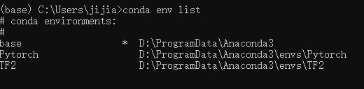
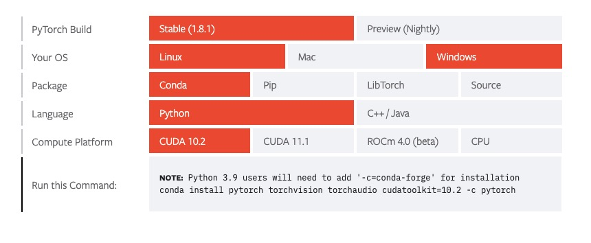
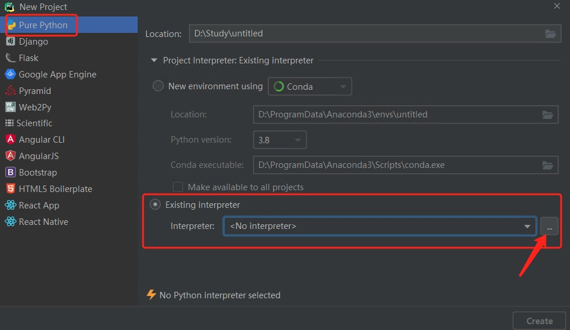
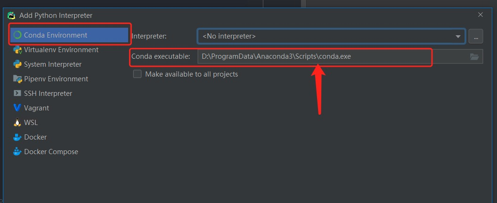

# 环境安装
=============

## Anaconda安装
1. 下载安装 [Anaconda Installation](https://docs.anaconda.com/anaconda/install/)
>关于是否加入环境变量。教学视频里会提示勾选，但是安装引导中提示可能引起其他软件安装错误。个人倾向于不勾选，在配置Pycharm的时候手动添加anaconda路径

2. 启动`Anaconda Prompt`(一个命令行终端)，配置anaconda环境
    1. `conda create -n myEnv python==3.8`创建环境，`-n`是`-name`的简写，指定环境名。指定python版本3.8（最新版本3.9，但是3.8比较成熟）
    2. `conda activate myEnv` 激活刚才建立的环境
    3. `conda env list` 查看你的所有环境，base是基础环境
    4. `conda env remove -name myEnv` 通过名称删除环境
>比如我创建了2个环境分别叫 tf 和 torch ,分别用来运行 tensorflow 和 pytorch



## GPU支持(选装，cpu选手跳过)
1. 安装`cudatoolkit`
```
conda install cudatoolkit=10.2
```
>我装了更新的11.0+，目前没有发现问题。但是11.0+很大，好像有1G多...
2. 安装`cudnn`
```
conda install cudnn=7.6
```

## 安装Tensorflow/Pytorch
1. 使用tensorflow
```
pip install -i https://pypi.tsinghua.edu.cn/simple tensorflow
```
1. 使用pytorch
pytorch 官网有anaconda安装指引，选择环境直接导出命令

```
conda install pytorch torchvision torchaudio cudatoolkit=10.2 -c pytorch
```

## Pycharm
1. 下载安装
2. 配置`python interpreter`（解释器）
    + 新建工程project
    
    + 选择`Existing interpreter`>`Conda Environment`>选择`interpreter`
        + 分支1，anaconda安装未勾选环境变量，需要手动查找。一般在`[Anaconda安装目录]/[你的环境名]/python.exe`
        + 分支2，勾选了环境变量。应该能自动显示`python.exe`
    
